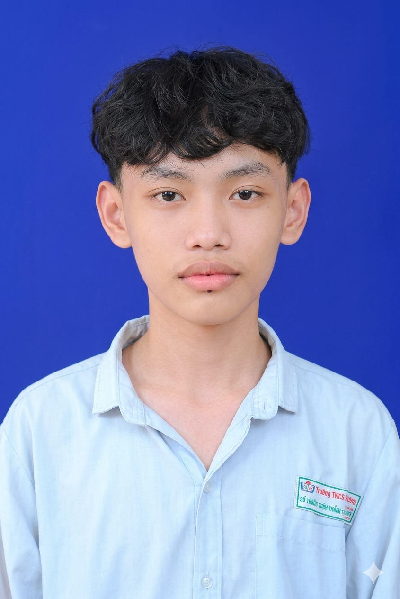

# Duong Van Hoa - Academic Portfolio

  

> **BIT_IC Student | FPT University**
> Major: Information Technology - IC / Semiconductor Design (BIT_IC)

---

## Profile

| Field | Details |
|-------|---------|
| **Full Name** | Duong Van Hoa |
| **Date of Birth** | June 20, 2006 |
| **Gender** | Male |
| **Address** | Phu Quy Hamlet, Vinh Xuong Commune, Tan Chau Town, An Giang Province, Vietnam |
| **Phone** | +84 972 000 481 |
| **Email (Personal)** | hoadvcs200558@gmail.com |
| **Email (Professional)** | DuongVanHoa.work@gmail.com |
| **LinkedIn** | [Duong Hoa](https://www.linkedin.com/in/d%C6%B0%C6%A1ng-h%C3%B2a-03baab399) |

---

## Academic Information

| Field | Details |
|-------|---------|
| **University** | FPT University |
| **Roll Number** | CS200558 |
| **Member Code** | HoaDVCS200558 |
| **Major** | BIT - Business Information Technology |
| **Specialization** | BIT_IC - IC / Semiconductor Design |
| **Study Mode** | Full-time (Regular program) |
| **Status** | In Progress - Term 3 |
| **Academic Deadline** | SU31 |
| **Previous Major** | BBA_MKT (transferred) |
| **Transfer Decision** | Decision No. 1399 - 12/12/2025 - FA25 |
| **Official Admission Decision** | Decision No. 1490/QD-DHFPT - August 2025 |

---

## 🚀 Featured Projects

* **[ESP32-CAM Person Tracker](https://github.com/duongvanhoawork-lang/esp32cam-person-tracker.git)**
  * An embedded computer vision system using ESP32-CAM to identify and track human presence in real-time. Combines hardware architecture, micro-controller programming, and software integration.

* **[FR5 Xiangqi Robot](./research/fr5_xiangqi_robot_v1)**
  * An autonomous Chinese Chess playing robot utilizing computer vision (YOLO), a Pygame GUI, and a Fairino FR5 robotic arm to calculate and execute physical moves.

---
## Repository Navigation

| Folder | Description |
|--------|-------------|
| [cv](./cv) | Curriculum Vitae files (template + latest PDF) |
| [certificates](./certificates) | Academic, language, technical, competition, volunteer certificates |
| [scholarships](./scholarships) | Scholarship applications and awards |
| [coursework](./coursework) | Course syllabi, assignments, and reports |
| [research](./research) | Research projects (ordered by priority) |
| [extracurricular](./extracurricular) | Events, clubs, and volunteering |
| [scripts](./scripts) | Helper scripts (CV generation, static site build) |
| [docs](./docs) | Portfolio guidelines and style guide |

---

## Confidentiality Notice

> **Notice:** Some projects, source code, and tutorial videos are kept private due to technology confidentiality and internal distribution policies.
> If you are a recruiter or collaborator and wish to review detailed implementations, please contact me directly:
> - **Email:** DuongVanHoa.work@gmail.com
> - **LinkedIn:** https://www.linkedin.com/in/d%C6%B0%C6%A1ng-h%C3%B2a-03baab399
